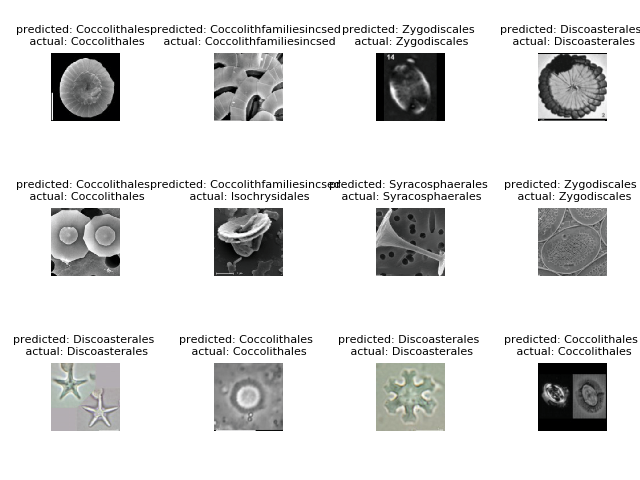

# Introduction

[Nannotax](http://www.mikrotax.org/Nannotax3/index.html) is a *authoritative guide to the biodiversity and taxonomy of coccolithophores* hosted on the Mikrotax platform.

This repository contains a crude screen-scraper that extracts a minimal amount of structured data and thumbnail imagery from Mikrotax web pages. This was created to produce a labelled training dataset of low-resolution coccolith images for use with [Torchvision](https://pytorch.org/docs/stable/torchvision/datasets.html)

Pytorch is used to train a neural net to recognise different classes of coccoliths. There's a re-training routine for a pre-trained VGG11 model, expanded from the transfer learning tutorial. The repository also features a misguided attempt to tweak the default VGG to add an adaptive average pool in place of some of the max pools so the images can be of arbitrary size (the source is a beautifully prepared collection of 120x120 thumbnails of scanning electron microscope images).

On the excellent advice of Simon Cozens there is now also a rambling set of systematic notes describing what changes are being made in response to what behaviours of the neural net / observations about the training data.



## Overview

Once collected, the data looks like this; 100-odd files, one for each entry in the navigation hierarchy, with a list of samples, each of which has several image URLs (not shown here):

```
{"hierarchy": ["Coccolithophores", "Coccolithfamiliesincsed", "narrowrimmedplacoliths", "Navilithus"], 
"samples":
    [{"taxon": "Navilithus altivelum", "thumbs":[ "URL", "URL, "URL" ]}]}
```

The image found at each URL ends up in the directory `./images` by default.

There is then a preparation script to run first and a model training script to run on the prepared data.

### ImageFolder preparation

The images are copied into a directory layout required by [torchvision.datasets.ImageFolder](https://pytorch.org/docs/stable/torchvision/datasets.html?highlight=imagefolder#torchvision.datasets.ImageFolder) with a sub-directory named for the classification label. The `--depth` indicates how far down the navigation hierarchy to sub-divide the images into classes. The default value is 3 which would give us about 30 classes but we are still testing the results with 9 classes resulting from `--depth 2`. This is how the current run was prepared:

  * `python prepare_image_model.py --data ./data/Coccolithophores/ --depth 2`

There are more options useful to do test runs training to loss 0 on a very small sample:

```
optional arguments:
  -h, --help            show this help message and exit
  --data DATA           Optional path of a directory on this host with JSON
                        source data
  --images IMAGES       Optional path of a directory on this host with image
                        files
  --train TRAIN         Optional path of a directory to lay out training data
                        in
  --class_limit CLASS_LIMIT
                        limit to this number of classes
  --sample_limit SAMPLE_LIMIT
                        limit to this number of samples per class
  --depth DEPTH         How far to look down the class hierarchy. Lower number
                        -> samples will be more distinct
```

### Model training

Run the image preparation step FIRST and then point the trainer at the resulting ImageFolders (by default it will look in `./train` and `./validate`. We currently have an 80/20 split of training and validation data.

```
usage: train_classifier.py [-h] [--directory DIRECTORY] [--log]

Train a model based on contents of a directory

optional arguments:
  -h, --help            show this help message and exit
  --directory DIRECTORY
                        Path of a directory on this host
  --log
```

### Visualise the training

The `--log` option to the train_classifier script will create Tensorboard event logs in './logs'. (The scalar values getting logged are still a bit off but the distributions and images look rasonable). The `tensorboard` executable is provided when you `pip install tensorflow`. Run it like this to watch the progress of a training run:

  * `tensorboard --logdir='./logs' --port=6006 &`

### Visualise the results

There's a quick script to visualise the predicted vs actual labels of the validation data which assumes the model is in a file named `model` and the validation image folder is in `validate`, and dumps out a `test.png`. Kindly ignore the exception it throws at the end. Example output is shown higher up in this README.

  * `python visualise_results.py`


